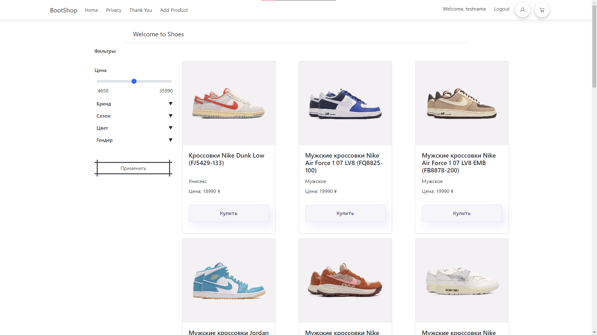
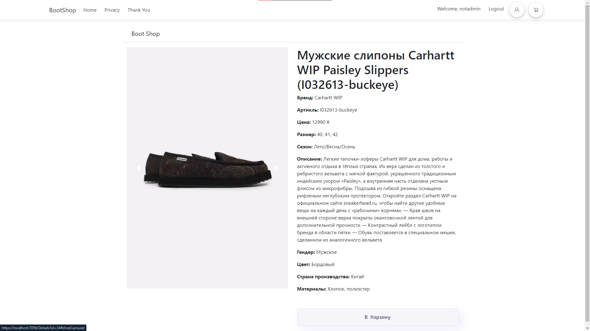

# BootShop-website
This site is a showcase web store selling shoes developed on ASP.NET Core (Razor Pages) and has all the basic attributes of a web store. It has the ability to register with the subsequent interaction with a personal account, view the product as well as adding it to your cart. Also there is a division of users into buyers and administrators who have the ability to add new products. To save user accounts, their baskets and the goods themselves is used to connect to a MySQL database.

